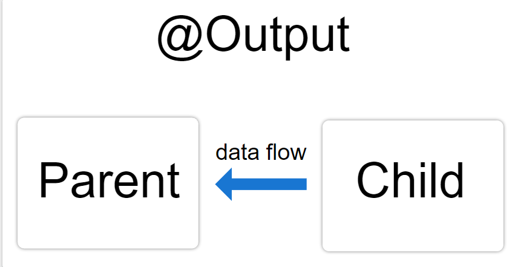
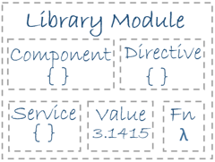

## 1. Angular 開發工具與環境建置
1. 下載node運行環境 [node官網](https://nodejs.org/en/)
    *  node -v : 查看node版本
    *  npm -v : 查看npm版本
2. 下載angular命令工具 `npm install -g @angular/cli`
    * ng -v : 查看angular cli版本
3. `ng new projectName` 創建angular專案
4.  cd projectName切換至該專案中
5. ` ng serve` or `npm run start` 開啟本地伺服器
6.  安裝瀏覽器開發者工具 Angular DevTools
## 2. 資料夾結構

### 專案資料夾之結構
* .editorconfig - 這個檔案可以幫助開發人員在不同的編輯器和 IDE 之間更容易定義與維護一致的編碼樣式。

* .git - Git 版本控制用的資料夾，Angular CLI 建立出來的專案，預設會加入版控。如果建立專案的時候不想要加入版控，可以加上 --skip-git 的參數來讓 CLI 不要將此專案加入版控。例如：ng new SampleProject --skip-git 。

* .gitignore - Git 版本控制用的忽略設定檔。值得一提的是，就算在建立專案時加入 --skip-git 參數，此檔案也會被創建出來。

* angular.json - Angular CLI 的設定檔。詳細說明可以參考 CK's Notepad 的 [Angular] Angular CLI - angular.json 檔說明，也可以參考隔壁棚 Angular 大師之路 的說明，都滿詳細的！

* dist/ - 編譯且打包過後的程式碼會放在這裡。一開始其實並不會看到此資料夾，是我為了介紹結構的關係，才先下指令讓其出現。

* node_modules/ - 此專案所有依賴的套件經由使用 npm install 安裝後，都會擺放到這裡。

* package-lock.json - 這個檔案是當我們使用 npm install 安裝套件時所產生的文件，用以記錄當前實際安裝的套件的來源與版號，當通過npm install下載時如果發現有package-lock.json檔案，就會根據該檔案中所記錄的版本進行下載。

* package.json - 這個檔案是用來定義我們這一專案中使用了哪些包的說明文件，像是應用程式的名稱、版本、描述、關鍵字、授權、貢獻者、維護者、腳本、相依的相關套件及其版本資訊等等。

* README.md - 這個檔案是這個專案的說明文件，採用 Markdown 的語法。可以自由撰寫關於此專案的任何說明。

* src/ - 主要在開發的所有程式碼都會放在這裡。

* tsconfig.json - 這個檔案是 TypeScript 編譯時看的編譯設定檔。

* tsconfig.app.json - 跟外層的 tsconfig.app.json 用途類似，在這個檔案裡也會看到有繼承外層的 tsconfig.app.json 的設定。

* tsconfig.spec.json - 跟 tsconfig.app.json 用途類似，不過主要是針對測試檔。

* karma.conf.js - Karma 的設定檔。Karma 是一套單元測試工具，是以 Jasmine 測試為基礎，並會透過偵測我們的程式碼變更並進行測試。Angular CLI 在建立專案時，預設會使用此套工具。也用有人會改為使用其他工具如：Jest、Mocha 來進行測試。

* browserslist - 檔案內其實有說明，大意就是 Angular 的編譯器會根據此檔案的設定來加上 CSS 的前綴，定義此專案要兼容的瀏覽器版本。

### src/ 資料夾結構

* app/ - 整個網頁應用程式的 Module、Component、Service 等等都放在這。其實整個專案除了 E2E 測試的程式碼之外，大概有九成九都是放這裡。

* assets/ - 靜態資源放置處，如圖片。

* environments/ - 環境變數設定檔放置處。建立專案時其實就有一併建立兩個檔案，environment.ts 與 environment.prod.ts。全系統的環境相關變數都請在這兩個檔案裡設定。

* favicon.ico - 瀏覽器的網址列、書籤、頁籤上都會用到的小 icon 圖檔。

* index.html - 整個網頁應用程式的首頁與根頁面，也是 SPA 唯一的那一頁。

* main.ts - Angular CLI 在編譯與打包的時候，把這支檔案裡的程式，當做整個網頁應用程式的主要程式進入點。

* polyfills.ts - 由於不同瀏覽器對代碼的兼融性不同，透過此檔案定義填充 API，使在舊版本瀏覽可以順利執行。

* styles.css - 整個網頁應用程式共用的樣式設定檔。

* test.ts - 跟 main.ts 檔類似，不過主要是用在測試檔上。
## 3. 生命週期:
Angular 實例化元件類別並渲染元件檢視及其子檢視時，元件實例的生命週期就開始了。生命週期一直伴隨著變更檢測，Angular 會檢查資料繫結屬性何時發生變化，並按需更新檢視和元件實例。當 Angular 銷燬元件實例並從 DOM 中移除它渲染的範本時，生命週期就結束了。

在某些時間段執行的特殊函數配稱作生命週期鉤子，這些生命週期函數是只要當組件中有對應名稱的函數，且觸發某狀態(例如:修改屬性值、傳遞新的值給子組件)的變化，angular就會幫我們調用這些涵式並執行裡面的內容。

### Constructor 建構式
*  constructor() 會在 class（類別）建立時最先被執行
* 是類別的屬性， Angular 並不能控制 constructor
* 只能取得class中預設的屬性
* 當 constructor 執行時，元件尚未被初始化，因此幾乎不會在這個階段寫程式碼
* 主要用於相依注入（dependency injection），例如服務、函式或值
```javascript
constructor(private service: HeroService) { }
```

### ngOnChanges
* 當元件 @Input/@Output 綁定的值發生變化時觸發
* 在 ngOnInit 之前執行
* 當沒有@Input/@Output綁定的值傳入時，就不會執行

### ngOnInit
* 用來初始化頁面內容，顯示數據綁定、設置 directive 和輸入屬性
* 在第一次 ngOnChanges 完成後呼叫，只執行一次
* 在此階段可以確保得到property binding後的結果

### ngDoCheck
* 當狀態發生變化，而 Angular 本身無法檢測該變化時觸發
* 在 ngOnChanges 和 ngOnInit 之後，於每次檢測變化時執行
* 使用時需注意：ngOnChanges 被觸發的頻率非常高，程式碼應盡量精簡，避免導致頁面性能問題

### ngAfterContentInit
* 頁面有使用 ng-content 進行元件內容投射
* 在初始化之後會執行一次

### ngAftertContentChecked
* 在每次檢查投射內容時執行
* 在每次呼叫 ngDoCheck 之後觸發

### ngAfterViewInit
* 在元件或其子元件檢視初始化之後，會執行一次

### ngAfterViewChecked
* 在每次檢視元件或其子元件之後觸發

### ngOnDestory
* 在元件被摧毀之前執行
## 4. 檢視封裝模式
在 Angular 中，元件的 CSS 樣式被封裝進了自己的檢視中，而不會影響到應用程式的其它部分。
透過在元件的元資料上設定檢視封裝模式，你可以分別控制每個元件的封裝模式。 可選的封裝模式一共有如下幾種：

1. ShadowDom : 不進不出，沒有樣式能進來，元件樣式出不去
2. Emulated（預設值，透過預處理（並改名)) : 只進不出，全域性樣式能進來，元件樣式出不去
3. None(不使用檢視封裝，Angular 會把 CSS 新增到全域性樣式中) : 能進能出
```javascript
encapsulation: ViewEncapsulation.ShadowDom
```
## 5. ViewChild
屬性裝飾器，用於配置一個檢視查詢。 變更檢測器會在檢視的 DOM 中查詢能匹配上該選擇器的第一個元素或指令。 如果檢視的 DOM 發生了變化，出現了匹配該選擇器的新的子節點，該屬性就會被更新。

簡單來說就是用於獲取當前檢視中的其他檢視，包括template、component、directive、container....元素的集合，可以想像是檢視版的querySelector

### ViewChild參數
* selector - 用於查詢的指令型別或名字。
* read - 從查詢到的元素中讀取另一個令牌。
* static - 如果為 true，則在變更檢測執行之前解析查詢結果，如果為 false，則在變更檢測之後解析。預設為 false

### ViewChild支援下列選擇器：

1. 任何帶有 `@Component` 或` @Directive` 裝飾器的類別
2. 字串形式的範本參考變數（比如可以使用 `@ViewChild('cmp')` 來查詢 `<my-component #cmp></my-component>`
3. 元件樹中任何當前元件的子元件所定義的提供者（比如 `@ViewChild(SomeService) someService: SomeService` ）
4. 任何透過字串令牌定義的提供者（比如 `@ViewChild('someToken') someTokenVal: any`）
5. TemplateRef（比如可以用 `@ViewChild(TemplateRef) template;` 來查詢 `<ng-template></ng-template>`）
## 6. 元件樣式
Angular 應用使用標準的 CSS 來設定樣式。這意味著你可以把關於 CSS 的那些知識和技能直接用於 Angular 程式中，例如：樣式表、選擇器、規則以及媒體查詢等。

另外，Angular 還能把元件樣式捆綁在元件上，以實現比標準樣式表更加模組化的設計。

### 範圍化的樣式
在 @Component 的元資料中指定的樣式只會對該元件的範本生效。

**樣式模組化特性**:

* 可以使用對每個元件最有意義的 CSS 類別名稱和選擇器。
* 類別名稱和選擇器是侷限於該元件的，它不會和應用中其它地方的類別名稱和選擇器衝突。
* 元件的樣式不會因為別的地方修改了樣式而被意外改變。
* 你可以讓每個元件的 CSS 程式碼和它的 TypeScript、HTML 程式碼放在一起，這將促成清爽整潔的專案結構。
* 將來你可以修改或移除元件的 CSS 程式碼，而不用遍歷整個應用來看它有沒有在別處用到。

### 特殊的選擇器:
**:host**
:host可以用於在樣式表中表示宿主元素，對於一般組件來說就是`<app-xxx></app-xxx>`

使用 `:host` 偽類別選擇器，用來選擇元件宿主元素中的元素（相對於元件範本內部的元素）。
```css
:host {
  display: block;
  border: 1px solid black;
}
```
要把宿主樣式作為條件，就要像函式一樣把其它選擇器放在 :host 後面的括號中。
```css
:host(.active) {
  border-width: 3px;
}
```

**:host-context**
:host-context() 偽類別選擇器它以類似 :host() 形式使用。它在當前元件宿主元素的祖先節點中查詢 CSS 類別， 直到文件的根節點為止

範例: 只有當某個祖先元素有 CSS 類別 theme-light 時，才會把 background-color 樣式應用到元件內部的所有 `<h2>` 元素中。
```css
:host-context(.theme-light) h2 {
  background-color: #eef;
}
```

### 把樣式載入進元件中

1. 設定 styles 或 styleUrls 元資料
```css
styles: ['h1 { font-weight: normal; }']
/* or */
styleUrls: ['./xxx.component.css']
```
2. 內聯在範本的 HTML 中
```javascript
@Component({
  selector: 'app-hero-controls',
  template: `
    <style>
      button {
        background-color: white;
        border: 1px solid #777;
      }
    </style>
    <h3>Controls</h3>
    <button (click)="activate()">Activate</button>
  `
})
```
3. 透過 CSS 檔案匯入
```css
@import './hero-details-box.css';
```
4. 範本中的 link 標籤
```javascript
@Component({
  selector: 'app-hero-team',
  template: `
    <!-- We must use a relative URL so that the AOT compiler can find the stylesheet -->
    <link rel="stylesheet" href="../assets/hero-team.component.css">
    <h3>Team</h3>
    <ul>
      <li *ngFor="let member of hero.team">
        {{member}}
      </li>
    </ul>`
})
```

### 外部以及全域性樣式檔案
當使用 CLI 進行建構時，你必須配置 angular.json 檔案，使其包含所有外部資源（包括外部的樣式表文件）。
在它的 styles 區註冊這些全域性樣式檔案，預設情況下，它會有一個預先配置的全域性 styles.css 檔案。
要了解更多，參閱 [樣式配置指南](https://angular.tw/guide/workspace-config#styles-and-scripts-configuration)。

### 非 CSS 樣式檔案
如果使用 CLI 進行建構，那麼你可以用 sass、less 或 stylus 來編寫樣式，並使用相應的副檔名（.scss、.less、.styl）把它們指定到 @Component.styleUrls 元資料中。例子如下：
```javascript
@Component({
  selector: 'app-root',
  templateUrl: './app.component.html',
  styleUrls: ['./app.component.scss']
})
```
CLI 的建構過程會執行相關的前處理器。
當使用 ng generate component 命令產生元件檔案時，CLI 會預設產生一個空白的 CSS 樣式檔案（.css）。 你可以配置 CLI，讓它預設使用你喜歡的 CSS 前處理器，參閱[工作區配置](https://angular.tw/guide/workspace-config#generation-schematics)指南中的解釋。

> 新增到 @Component.styles 陣列中的字串必須寫成 CSS，因為 CLI 沒法對這些內聯的樣式使用任何 CSS 前處理器。
## 7. 父子指令及元件之間共享資料
Angular 中的一個常見模式就是在父元件和一個或多個子元件之間共享資料。可以用 `@Input()` 和` @Output()` 來實現這個模式。
```html
<parent-component>
  <child-component></child-component>
</parent-component>
```
<parent-component> 充當了 <child-component> 的上下文。

`@Input()` 和 `@Output()` 為子元件提供了一種與其父元件通訊的方法。` @Input()` 允許父元件更新子元件中的資料。相反，`@Output()` 允許子元件向父元件傳送資料。

### 把資料傳送到子元件
子元件或指令中的 @Input() 裝飾器表示該屬性可以從其父元件中獲取值


**配置子元件**
```javascript
import { Component, Input } from '@angular/core'; 

@Component({
    selector: 'app-child',
})
export class ItemDetailComponent {
    // 宣告一個用於儲存來自於外層組件傳遞的值的變數，並使用Input裝飾
    @Input() item = ''; 
}
```

```html
<p>
  Today's item: {{item}}
</p>
```

**配置父元件**
```html
<!-- 通過property binding綁定到子組件身上的item屬性 -->
<app-item-detail [item]="currentItem"></app-item-detail>
```
```javascript
export class AppComponent {
  currentItem = 'Television';
}
```

**整體結構**


### 把資料傳送到父元件
子元件或指令中的 @Output() 裝飾器允許資料從子元件傳給父元件。


@Output() 在子元件中標記了一個屬性，作為資料從子元件傳遞到父元件的途徑。

子元件使用 @Output() 屬性來引發事件，以通知父元件這一變化。為了引發事件， @Output() 必須是 EventEmitter 型別，它是 @angular/core 中用來發出自定義事件的類別。

**配置子元件**

1. 在子元件類別中匯入 Output 和 EventEmitter
```javascript
import { Output, EventEmitter } from '@angular/core';
```
2. 在元件類別中，用 @Output() 裝飾一個屬性。下面的例子中 newItemEvent 這個 @Output() 的型別為 EventEmitter ，這意味著它是一個事件。
```javascript
@Output() newItemEvent = new EventEmitter<string>();
```

上述宣告中的差異：
* `@Output()` - 一個裝飾器函式，它把該屬性標記為資料從子元件進入父元件的一種途徑
* newItemEvent - 這個 `@Output()` 的名字
* `EventEmitter<string>` - 這個`@Output()` 的型別
* `new EventEmitter<string>()` - 使用 Angular 來建立一個新的事件發射器，它發出的資料是 string 型別的。

3. 建立一個發出事件的方法
```javascript
export class ItemOutputComponent {

  @Output() newItemEvent = new EventEmitter<string>();

//  現再只要透過addNewItem就能觸發事件並傳出數據
  addNewItem(value: string) {
    this.newItemEvent.emit(value);
  }
}
```
4. 配置子元件的範本
```html
<label for="item-input">Add an item:</label>
<input type="text" id="item-input" #newItem>
<button (click)="addNewItem(newItem.value)">Add to parent's list</button>
```
**配置父元件**
1. addItem() 方法接受一個字串形式的引數，然後把該字串新增到 items 陣列中。
```javascript
export class AppComponent {
  items = ['item1', 'item2', 'item3', 'item4'];

  addItem(newItem: string) {
    this.items.push(newItem);
  }
}
```
2. 子元件選擇器（`<app-item-output>`）放在父元件的範本 app.component.html 中，並通過事件繫結綁定 newItemEvent這個子組件事件。
```html
<!-- $event 中包含使用者在子元件範本上的 <input> 中鍵入的資料 -->
<app-item-output (newItemEvent)="addItem($event)"></app-item-output>
```

### 同時使用 @Input() 和 @Output()
結合Input由父向子傳遞數據，Output子向父發送自定義事件，來達到雙向綁定的效果，效果等同於使用ngModel。
```html
<app-input-output [item]="currentItem" (deleteRequest)="crossOffItem($event)"></app-input-output>
```

## 8. 內容投影
內容投影是一種模式，你可以在其中插入或投影要在另一個元件中使用的內容。例如，你可能有一個 Card 元件，它可以接受另一個元件提供的內容。

* 單插槽內容投影 : 使用這種型別的內容投影，元件可以從單一來源接受內容。
* 多插槽內容投影 : 在這種情況下，元件可以從多個來源接受內容。
* 有條件的內容投影 : 使用條件內容投影的元件僅在滿足特定條件時才渲染內容。

### 單插槽內容投影
內容投影的最基本形式是單插槽內容投影。單插槽內容投影是指建立一個元件，你可以在其中投影一個元件。

1. 在子組件中加入ng-content(及是你所要插入的內容所放的位置)。
```javascript
import { Component } from '@angular/core';

@Component({
  selector: 'app-child',
  template: `
  <h2>我是子組件</h2>
  <ng-content></ng-content>
`
})
export class ChildComponent {}
```
2. 在父組件中加入子組件，並在content區塊中放入所要傳遞的內容。
```html
<parent>
  <p>這是要傳遞給自子組件的內容</p>
</parent>
```
> ng-content 元素是一個佔位符，它不會建立真正的 DOM 元素。ng-content 的那些自訂屬性將被忽略。

### 多插槽內容投影
一個元件可以具有多個插槽。每個插槽可以指定一個 CSS 選擇器，該選擇器會決定將哪些內容放入該插槽。該模式稱為多插槽內容投影。使用此模式，你必須指定希望投影內容出現在的位置。你可以透過使用 ng-content 的 select 屬性來完成此任務。

1. 創建子組件並添加ng-content，同時透過select指定插槽名稱(支援標籤名、屬性、CSS 類別和 :not 偽類別的任意組合)
```javascript
import { Component } from '@angular/core';

@Component({
  selector: 'app-child',
  template: `
  <h2>這是子組件</h2>
  <ng-content></ng-content>
  // 以屬性作為插槽名稱
  <ng-content select="[slot1]"></ng-content>
`
})
export class ChildComponent {}
```
2. 在父組件中加入子組件，並對不同區塊指定與select相對應的選擇器
```html
<app-child>
  <p slot1>
    這個內容要放的slot1中
  </p>
  <p>這個內容放到預設的插槽中</p>
</app-child>
```

### 有條件的內容投影
這種投影是透過templateRef+contentChild+ngTemplateOutlet+directive所構築。
* templateRef: 代表對模板(ng-template)的參照
* contentChild: 用於對從父組件投影過來的內容進行查詢，在這裡的目的是為了獲取directive
* ngTemplateOutlet: 此指令是一個結構指令，需要與ng-container搭配，接受一個temlateRef，並根據這個temlateRef在ng-container所在的位置建構template中的內容
* directive: 用於對檢視(檢視可以是組件或指令)進行操作，在這裡作為中間人接收inject獲得template的templateRef，以提供給ngTemplateOutlet

1. 在父組件中加入子組件，並將實際要展示的內容透過ng-template進行包裹
2. 創建一個directive，將其綁定到ng-template上面
3. 在directive中使用inject注入templateRef
4. 回到子組件，引入contentChild和前面創建的directive，並使用contentChild去獲取directive，而directive身上擁有要展示的templateRef
5. 在子組件創建一個ng-container並添加ngTemplateOutlet指令，同時將ngTemplateOutlet綁定從directive中獲取的templateRef`<ng-container [ngTemplateOutlet]="content.TemplateRef"> </ng-container>`
## 9. ViewChild 和 ViewChildren 的差別/TemplateRef<xxx>、ElementRef、ViewContainerRef的差別
### View檢視是甚麼?
所謂檢視即是展示ui的最小單位，每個元素都可視為一個view，組件通過大大小小不同的元素所構成，算是view的集合，directive、template、container都算是某種特殊的html元素各自負責不同的功能，但都能被視為檢視。

### ViewChild
主要的功能就是可以獲得當前檢視(組件的html)中的內容元素、組件、模板、容器的參照，這些參照上面分別提供不同的Api讓我能夠去對當前的檢視進行操作，通過ViewChild我們可以獲得三種不同的參照分別是以下三種:

* `TemplateRef<xxx>`模板參照:
    1. 模板參照只能在ng-template上面獲得，簡單來說除了ng-template其他不能當作模板，包括ng-container
    2. 可以使用directive，通過依賴注入的方式獲得當前模板的TemplateRef
* `ElementRef`元素參照:
    1. ElementRef顧名思義就似可以獲取某個DOM節點的參照，獲取之後可以直接對DOM節點進行操作，但不建議直接操作DOM
    2. ng-template和ng-container也可獲得ElementRef，兩者都對應的一個註釋節點
* `ViewContainerRef`
    1. 所有的節點，只要能夠包容其他節點，都可以被看做是一個ViewContainerRef
    2. ViewContainerRef上面有提供對節點操作的API，包括新增、刪除、插入....
    3. ng-template可以同時當作 ViewContainerRef 和 TemplateRef<xxx> ，因此可以借助directive完成自定義的創建

### ViewChildren
與ViewChild相比功能類似，主要的功能是一次獲取多個檢視參照，假如當前的component view中有多個，標籤元素、模板元素、容器元素，且他們的參照名稱相同，就可以用到ViewChildren，他的返回值是QueryList一個特別的物件陣列，裡面會包含所有獲取到的同名參照。

#### 如何標記ref : #xxx
 ```html
 <h1 #myh1>我是h1元素</h1>
 ```

### ng-Template vs ng-Container
1. ng-Template
    * 通常搭配結構指令進行結構操作
    * 可以使用ng-xx等預設的指令
    * 如果不通過結構指令操作則**不會顯示**
    * 若使用結構指令操作，創建出真實節點後，不占位(不會被渲染)
2. ng-Container
    * 通常會在 ng-For 和 ng-If 要同時使用在同個元素上時使用，作為不占位的外層容器掛載其中一個指令，解決發生錯誤的問題(結構指令在一個元素身上只能有一個)
    * 本身即是容器，可以通過viewContainerRef插入元素在底下
    * 可以使用ng-xx等預設的指令
    * 就算不使用結構指令，也可以顯示包含的內容，最終展示時不會佔位

### contentChild與contentChildren是甚麼?
contentChild與ViewChild功能類似，但是其查找的是通過宿主組件船過來的內容，而contentChildren也同ViewChildren可以同時查詢多個同名的參照，以下面為例，查詢的檢視是app-hild所包裹的區域，也就是content的部分。

```html
<h1><!-- 這裡算是View -->
  我是父組件Parent <!-- 這裡算是Content -->
</h1>  
<app-hild>
    <div #childDiv>
        <h1 #childTitle>我是透過插槽傳入Child組件的內容</h1>
    </div>
</app-hild>
```

```html
<h1>我是子組件Child</h1>
<ng-content><ng-content>
```
## 10.NgModule
Angular 應用是模組化的，它擁有自己的模組化系統，稱作 NgModule。 一個 NgModule 就是一個容器，用於存放一些內聚的程式碼塊，這些程式碼塊專注於某個應用領域、某個工作流或一組緊密相關的功能。 它可以包含一些元件、服務提供者或其它程式碼檔案，其作用域由包含它們的 NgModule 定義。 它還可以匯入一些由其它模組中匯出的功能，並匯出一些指定的功能供其它 NgModule 使用。

上面的這段簡單來說就是，NgModule是一些組件的管理員，管理要使用那些模組，使用哪些服務，這也就是為甚麼創建完組件後要再NgModule中宣告，因為管理員不知道，他怎麼通知其他人(組件)。

### NgModule 和 元件(Component)
NgModule 為其中的元件提供了一個編譯上下文環境。根模組總會有一個根元件，並在引導期間建立它。 但是，任何模組都能包含任意數量的其它元件，這些元件可以透過路由器載入，也可以透過範本建立。那些屬於這個 NgModule 的元件會共享同一個編譯上下文環境。


元件及其範本共同定義檢視。元件還可以包含檢視層次結構，它能讓你定義任意複雜的螢幕區域，可以將其作為一個整體進行建立、修改和銷燬。 一個檢視層次結構中可以混合使用由不同 NgModule 中的元件定義的檢視。 這種情況很常見，特別是對一些 UI 函式庫來說。


當你建立一個元件時，它直接與一個叫做宿主檢視的檢視關聯起來。 宿主檢視可以是檢視層次結構的根，該檢視層次結構可以包含一些內嵌檢視，這些內嵌檢視又是其它元件的宿主檢視。 這些元件可以位於相同的 NgModule 中，也可以從其它 NgModule 中匯入。 樹中的檢視可以巢狀到任意深度。

上面這段話，我的解釋是，當一元件建立時，會產生一個View及是html template所對應的內容，對於當前組件中的其他view區塊來說，他是宿主因為都寄宿在他身上，而其底下的每個view被稱為內嵌檢視，而**內嵌檢視**也可以做為其他view的**宿主檢視**。


### @NgModule 元資料
NgModule 是一個帶有 @NgModule() 裝飾器的類別。@NgModule() 裝飾器是一個函式，它接受一個元資料物件，該物件的屬性用來描述這個模組。其中最重要的屬性如下:

* declarations（可宣告物件表） —— 那些屬於本 NgModule 的元件、指令、管道。
* exports（匯出表） —— 那些能在其它模組的元件範本中使用的可宣告物件的子集。
* imports（匯入表） —— 那些匯出了本模組中的元件範本所需的類別的其它模組。
* providers —— 本模組向全域性服務中貢獻的那些服務的建立器。 這些服務能被本應用中的任何部分使用。（你也可以在元件級別指定服務提供者，這通常是首選方式。）
* bootstrap —— 應用的主檢視，稱為根元件。它是應用中所有其它檢視的宿主。只有根模組才應該設定這個 bootstrap 屬性。

### Angular 自帶的函式庫
Angular 會作為一組 JavaScript 模組進行載入，你可以把它們看成函式庫模組。每個 Angular 函式庫的名稱都帶有 @angular 字首。 使用 npm 套件管理器安裝 Angular 的函式庫，並使用 JavaScript 的 import 語句匯入其中的各個部分。


```javascript
import { BrowserModule } from '@angular/platform-browser';
// ......
// 在當前的NgModel中引入其他模塊，藉以使用該模塊中的內容
imports:      [ BrowserModule ],
```
## 11.服務server 與 依賴注入dependency injection
### 服務(server)
服務是一個廣義的概念，它包括應用所需的任何值、函式或特性。狹義的服務是一個明確定義了用途的類別。它應該做一些具體的事，並做好。

Angular 把元件和服務區分開，以提高模組性和複用性。 透過把元件中和檢視有關的功能與其它型別的處理分離開，你可以讓元件類別更加精簡、高效。

理想情況下，元件的工作只管使用者體驗，而不用顧及其它。 它應該提供用於資料繫結的屬性和方法，以便作為檢視（由範本渲染）和應用邏輯（通常包含一些模型的概念）的中介者。

元件應該把諸如從伺服器獲取資料、驗證使用者輸入或直接往控制檯中寫日誌等工作委託給各種服務。透過把各種處理任務定義到可注入的服務類別中，你可以讓它被任何元件使用。 透過在不同的環境中注入同一種服務的不同提供者，你還可以讓你的應用更具適應性。

### 依賴注入(dependency injection)
DI 被融入 Angular 框架中，用於在任何地方給新建的元件提供服務或所需的其它東西。 元件是服務的消費者，也就是說，你可以把一個服務注入到元件中，讓元件類別得以訪問該服務類別。

在 Angular 中，要把一個類別定義為服務，就要用 @Injectable() 裝飾器來提供元資料，以便讓 Angular 可以把它作為依賴注入到元件中。 同樣，也要使用 @Injectable() 裝飾器來表明一個元件或其它類別（比如另一個服務、管道或 NgModule）擁有一個依賴。

* 注入器是主要的機制。Angular 會在啟動過程中為你建立全應用級注入器以及所需的其它注入器。你不用自己建立注入器。
* 該注入器會建立依賴、維護一個容器來管理這些依賴，並儘可能複用它們。
* 提供者是一個物件，用來告訴注入器應該如何獲取或建立依賴。

你的應用中所需的任何依賴，都必須使用該應用的注入器來註冊一個提供者，以便注入器可以使用這個提供者來建立新實例。 對於服務，該提供者通常就是服務類別本身。

> 依賴不一定是服務 —— 它還可能是函式或值。

當 Angular 建立元件類別的新實例時，它會透過檢視該元件類別的建構函式，來決定該元件依賴哪些服務或其它依賴項。 比如 UserListComponent 的建構函式中需要 UserService：
```javascript
constructor(private service: UserService) { }
```

當 Angular 發現某個元件依賴某個服務時，它會首先檢查是否該注入器中已經有了那個服務的任何現有實例(**這句話的意思就是，Angular 發現某個元件依賴某個服務時，他會先查看當前是否已經有了同名的服務的實例對象**)。如果所請求的服務尚不存在，注入器就會使用以前註冊的服務提供者來製作一個，並把它加入注入器中，然後把該服務返回給 Angular。


### 提供服務
對於要用到的任何服務，你必須至少註冊一個提供者。服務可以在自己的元資料中把自己註冊為提供者，這樣可以讓自己隨處可用。或者，你也可以為特定的模組或元件註冊提供者。


* 預設情況下，Angular CLI 的 ng generate service 命令會在 @Injectable() 裝飾器中提供元資料來把它註冊到根注入器中。本課程就用這種方法註冊了 UserService 的提供者：
```javascript
@Injectable({
    providedIn: 'root',
})
```
當你在根一級提供服務時，Angular 會為 UserService 建立一個單一的共享實例，並且把它注入到任何想要它的類別中。這種在 @Injectable 元資料中註冊提供者的方式還讓 Angular 能夠透過移除那些從未被用過的服務來優化大小。

* 當你使用特定的 NgModule 註冊提供者時，該服務的同一個實例將會對該 NgModule 中的所有元件可用。要想在這一層註冊，請用 @NgModule() 裝飾器中的 providers 屬性：

```javascript
@NgModule({
  providers: [
    BackendService,
    Logger
 ],
 ...
})
```
### 建立可注入服務+注入服務
1. `ng generate service users/user`
2. 確認是否有在ngModule中的providers選項中註冊這個server，如果providedIn: 'root'的話可以不用註冊
<!-- 
    @Injectable() 裝飾器會指定 Angular 可以在 DI 體系中使用此類別。元資料 providedIn: 'root' 表示 UserService 在整個應用程式中都是可見的。
 -->
```javascript
import { Injectable } from '@angular/core';

@Injectable({
  providedIn: 'root',
})
export class UserService {
  constructor() { }
  // 添加可使用的函數 與 儲存在服務的數據
}
```
3. 在需要注入server的組件中引入該server的class類
```javascript
import UserService ... 
```
4. 在constructor中注入
```javascript
constructor(us: UserService){}
```
## 12. Pipe管道
管道用來對字串、貨幣金額、日期和其他顯示資料進行轉換和格式化。管道是一些簡單的函式，可以在範本表示式中用來接受輸入值並返回一個轉換後的值。例如，你可以使用一個管道把日期顯示為 1988 年 4 月 15 日，而不是其原始字串格式。

Angular 為典型的資料轉換提供了內建的管道，包括國際化的轉換（i18n），它使用本地化資訊來格式化資料。資料格式化常用的內建管道如下：

* DatePipe：根據本地環境中的規則格式化日期值。
* UpperCasePipe：把文字全部轉換成大寫。
* LowerCasePipe ：把文字全部轉換成小寫。
* CurrencyPipe ：把數字轉換成貨幣字串，根據本地環境中的規則進行格式化。
* DecimalPipe：把數字轉換成帶小數點的字串，根據本地環境中的規則進行格式化。
* PercentPipe ：把數字轉換成百分比字串，根據本地環境中的規則進行格式化。

### 使用管道
```html
<!-- 該元件的 birthday 值透過管道運算子（|）流向 date 函式。 -->
<p>The hero's birthday is {{ birthday | date }}</p>
```

###  自定義Pipe:
1. 創建一個xxx.pipe.ts檔案
2. 建立一個class並使用Pipe裝飾器包裝(Pipe 與 PipeTransform 都通過@angluar/core引入)
3. 引入PipeTransform傳換介面，class xxx implement PipeTransform
4. 實作transform方法，必須要有返回值
5. 在module中的declarement中宣告
6. 直接在組件中使用

其他:
* PipeTransform除了可以接取傳入的目標數據，也可以傳入其他參數，通過 : 進行傳遞 ，需要先在涵式中定義
## 13. 數據綁定與事件綁定
請直接觀看實例_02
## 14. 路由
### 什麼是路由？
路由是當一台聯接上網路的裝置，想要前往另外一台聯接上網的設備所經過的【路】(該如何前往目標設備)，路由紀錄道路上的一系列訊息，像是目標設備的地址等，傳統網頁是透過後端路由實現，一個路由對應一個回調，當有某台電腦連接到同名的網址下時，就會執行這個回調反回一個頁面，每當切換頁面時就會重新獲取一個新的頁面，導致畫面不斷閃屏，如今ajax的出現讓這一切有了解答，ajax可以動態的向伺服器獲取資料並透過javascript進行修改，此過程不會發生跳轉，這樣的效果被使用在了框架上，因而出現spa網頁，spa就是只有一個頁面的網頁，所有的內容都透過ajax動態的向後端獲取資料，但這樣也衍生了一個問題，由於不會跳轉，也就沒了上下頁的紀錄，只要重新整理spa的網頁就會讓當前查詢的內容消失(因為都會回到最初的畫面)，因為重新去獲取了一次spa頁面，為了解決這個問題，出現了前端路由，透過對html5的hisotry與hash的封裝與操控，構成前端路由，所謂的前端路由是透過javascript去改變path形成上下頁，而前端路由會紀錄每個頁面的相關內容，讓使用者不會再因為刷新而重頭再來。

### angular前端路由:
前端路由由一個主路由器管理，也可以有其他的子路由，angular會幫助這些子路由合併到主路由上，再來一個路由器管理多個路由，就像是多條道路有一個統一的閘道，想要去其他路就要通過這個閘道管理員的管理，才能放行。路由器的基礎是一個模塊，需要引入到自己的模塊中並配置一個個路由，最後在頁面中加入導航和錨點才能夠使用。

在大多數的框架中，一個路由是由path對應一個component，可以想像是key對value的感覺，當我想前往這個某個path時，就會查找到對應的組件，並展示出來，而路由間可以不斷嵌套，也就是說一個路由可以有多個子路由。

angular主要負責重新配置頁面中應該顯示哪些 Component，儲存頁面中 Component 的路由狀態，像是在某個路由的時候應該顯示哪些 Component，以及路徑與 Component 之間的關係。

### 啟用路由追蹤記錄的功能
在 app-routing.module.ts 裡的 RouterModule.forRoot 函式裡加入 { enableTracing: true } 的參數
```javascript
@NgModule({
  imports: [RouterModule.forRoot(routes, {
    enableTracing: true
  })],
 exports: [RouterModule],
 providers: []
})
export class AppRoutingModule { }
```
### 路由連結
**傳統頁面的超連結**
```html
 <a href=""></a>
```
**Angualr 的路由超連結**
1. 用屬性綁定的方式傳入字串:
```html
<ul>
  <li><a [routerLink]="'/home'">Home</a></li>
  <li><a [routerLink]="'/about'">About</a></li>
</ul>
```
2. 用屬性綁定的方式傳入字串陣列
```html
<ul>
  <li><a [routerLink]="['/home']">Home</a></li>
  <li><a [routerLink]="['/about']">About</a></li>
</ul>
```
3. 用屬性名稱的方式並直接給予路由名稱
```html
<ul>
  <li><a routerLink="/home">Home</a></li>
  <li><a routerLink="/about">About</a></li>
</ul>
```

### 創建基本angular路由
1. 引入RouterModule和Routes，`import { Routes, RouterModule } from '@angular/router';`
    * RouterModule是angular提供的其中一個模塊，讓我們可以創建自己的路由器
    * Routes是路由模板，用來定義路由結構，它們使用的組件以及路徑等配置
    * Routes是類型結構需要綁到一個實際的變數上
2. 建立Routes+引入當前模塊中(imports)
    1. 在NgModule中建構
    ```javascript
     imports: [
           BrowserModule,
           RouterModule.forRoot([
           {path: ''home, component: HomeComponent},
           {path: 'about', component: AboutComponent},
        ]),
      ],
    ```
    2. 另外創建一個檔案配置routes(可以不須引入routes)
    ```javascript
    // routes.ts
     export const routes:Routes=[
              {
                //指定路由路徑
                path: ''home, 
                // 指定對應的組件
                component: HomeComponent
              },
              {
                path: 'about', 
                component: AboutComponent
                },
        ]
    ```

    ```javascript
    // xxx.module.ts
     import {routes} from ......;

     imports: [
           BrowserModule,
           RouterModule.forRoot(routes),
      ],
    ```
3. 在模板中添加路由導航
    ```html
      <a routeLink="/home">Home</a>
      <a routeLink="/about">Home</a>
    ```
4. 加入插入組件的錨點
    ```html
      <router-outlet></router-outlet>
    ```

### 路由策略
主要分為PathLocationStrategy(預設)和HashLocationStrategy而這兩者的差別:

1. PathLocationStrategy不會有#在網址中HashLocationStrategy會有
2. PathLocationStrategy在真正上線使用前需要先搭配後端配置對應的path否則會導致錯誤
3. HashLocationStrategy是採用頁面錨點#標示跳轉，在切換不同頁面的時候不會帶入#後的path
4. HashLocationStrategy兼融性較強，畢竟html5的history相比錨點跳轉還是較新的


### routerLinkActive
當找到比配的路徑的路由時會根據routerLinkActive中所配置的內容添加樣式到該導航上面

1. 用屬性綁定的方式傳入字串
```html
<ul>
  <li>
    <a 
      [routerLink]="'/home'"
      [routerLinkActive]="'active'"
    >Home</a>
  </li>
</ul>
```
2. 用屬性綁定的方式傳入字串陣列
```html
<ul>
  <li>
    <a 
      [routerLink]="'/home'"
      [routerLinkActive]="['active']"
    >Home</a>
  </li>
</ul>
```
3. 用屬性名稱的方式並直接給予類別名稱
```html
<ul>
  <li>
    <a 
      [routerLink]="'/home'"
      routerLinkActive="active"
    >Home</a>
  </li>
</ul
```

#### routerLinkActive的比對方式?
路由器在比對時會先將路徑拆開，例如:/products/a，轉變成products、b，然後一個個比對，當相符時觸發匹配

當我導向/products/b這個路徑時，首先路由器會先比較/new、/story發現都不匹配，再來到/products發現有匹配(預設不會使用完全匹配)，再來找到底下的children路由，找/products/a發現不對，最後/products/b找到了，完全匹配，結果是匹配的路由有/products和/products/b，所以這兩個匹配的路由都會添加上樣式

不過如果我們今天不想要連父層也一起套用的話，我們可以在父層的連結上多增加 [routerLinkActiveOptions]="{exact: true}" 的設定即可，像是：
```html
<ul>
  <li>
    <a
      [routerLink]="'news'"
      routerLinkActive="active"
    >News</a>
  </li>
  <li>
    <a
      [routerLink]="'products'"
      [routerLinkActive]="'active'"
      [routerLinkActiveOptions]="{exact: true}"
    >Products</a>
  </li>
  <li>
    <a
      [routerLink]="['products', 'a']"
      [routerLinkActive]="'active'"
    >Product A</a>
  </li>
</ul>
```

### 預設路由
當網頁初次返回使用者的瀏覽器時並沒有指定某個path，因此path是空的，為此需要配置一個路由來處理，不然會空白畫面，我們稱這個路由配置為預設路由
```javascript
{ 
  path: ' ',
  component: HomeComponent
}
```
### 萬用路由(轉向路由)
這個路由是當所有的路由配置都不符合時，會通過這個路由進行跳轉，當項預先設定的某個路由頁面
```javascript
{
  // ** 表示不管什麼路徑都匹配此路由
  path: '**', 
  // 功能同其名，將此路由轉導向某個路由
  redirectTo: 'home', 
  // 由於使用redirectTo所以必須配置此設定，否則抱錯
  pathMatch: 'full'
}
```
> 特別要注意的是，路由是有順序性的，因為 Angular 的路由機制在比對路由的時候，是從頭一個一個比對的。如果其中有兩個同樣 path 的路由，會顯示的一定是放在比較前面的那個。而萬用路由則是一定要放在最後一個，不然你會發現在它後面的路由怎樣都不會出現。

### 路由插座`<router-outlet></router-outlet>`
路由插座很像ng-content的效果，同樣會佔位，並把符合設定得內容呈現在這裡
```html
<ul>
  <li><a [routerLink]="'/home'">Home</a></li>
  <li><a [routerLink]="'/about'">About</a></li>
</ul>

<router-outlet></router-outlet>
```

### 封裝RouterModule
1. 創建一個AppRoutingModule
2. 將routes改成引入在此Module配置以下內容
```javascript
import { NgModule } from '@angular/core';
import { RouterModule } from '@angular/router';
import { myRoutes } from './router';

@NgModule({
  declarations: [],
  // 這裡需要注意一個應用只會有一個root router但可以有多個child router所以要判斷好哪個router module要當根路由
  // 當有其他子路由模塊要引入時需要在根路由前先引入
  imports: [RouterModule.forRoot(myRoutes)],
  exports: [RouterModule],
})
export class AppRoutingModule {}
```
3. 在主Module中引入
```javascript
@NgModule({
  declarations: [
    AppComponent,
    HomeComponent,
    AboutComponent,
  ],
  imports: [
    BrowserModule,
    // XXXRoutingModule其他子路由模塊放在這，放在AppRoutingModule後會導致一個問題，模塊最終讀的是root router，如果他先創建完了，那子child router就無法配置進去，導致失效
    AppRoutingModule
  ],
  providers: [],
  bootstrap: [AppComponent]
})
export class AppModule { }
```
### 注入路由與路由器
```javascript
import { ActivatedRoute, Router } from '@angular/router';

constructor(private route:ActivatedRoute,private router:Router){

}
```
* ActivatedRoute : 
  1. 此注入的實例表示當前所匹配的路由(某一個路由)
  2. 此物件中紀錄當前路由的訊息，包括傳遞到此路由的參數，路徑字串等
* Router : 
  1. 此注入的實例表示唯一的路由器(所有路由的管理員)
  2. 路由器提供像navigate等方法讓我們可以動態操作路由

### 模組延遲載入
這個功能可以讓使用者需要某個功能或頁面的時候，就只下載這某個功能或頁面的程式碼回來。進而使得在頁面初始化所耗費的時間更少，因只需要下載與執行當下所需之程式碼而已。當一個系統規模越大時，節省的時間與提昇的效能就越發可觀。

將原本在AppModule中引入的OtherModule改為透過延遲載入
1. 修改OtherModule的子路由配置
```javascript
  {
    path: '',
    component: FeatureComponent,
  },
```
2. 移除AppModule中對OtherModule的引入

3. 配置新的route
```javascript
  {
    path: 'feature', // 此路徑會成為OtherModule整個模塊子路由的根路由路徑也就是 /feature
    loadChildren: () =>
      import('./other.module').then((module) => module.OtherModule),
  },
```

### 預先載入
預先載入是在頁面初始化的時候就把所有可延遲載入的模組透過背景非同步地下載(當瀏覽器空閒時下載)，不會影響畫面的顯示或使用者的操作

1. 在AppRoutingModule(根RouterModule所在的模塊)中引入`import { PreloadAllModules } from '@angular/router';`
2. 設定RouterModule參數
```javascript
@NgModule({
  imports: [RouterModule.forRoot(routes, {
    // useHash: true, 設定為hash模式
    preloadingStrategy: PreloadAllModules //設定預載入模式
  })],
  exports: [RouterModule],
  providers: []
})
```

### 路由守衛(Guard)
一般常見使用路由守門員的時機大致上有兩種：

* canActivate － 當使用者想要造訪某個路由時，透過路由守門員來判斷要不要讓使用者造訪。
* canActivateChild － 基本功能同上，但可以守衛所有子路由。
* canDeactivate － 當使用者想要離開某個路由時，透過路由守門員來判斷要不要讓使用者離開。

**canActivate + canActivateChild的使用方式：**
1. 配置路由守衛 `ng generate guard xxx`
```javascript
import { Injectable } from '@angular/core';
import {
  ActivatedRouteSnapshot,
  CanActivate,
  CanActivateChild,
  RouterStateSnapshot,
  UrlTree,
} from '@angular/router';
import { Observable } from 'rxjs';

@Injectable({
  providedIn: 'root',
})
export class AuthGuard implements CanActivate, CanActivateChild {
  // 此為路由守衛
  canActivate(
    route: ActivatedRouteSnapshot,
    state: RouterStateSnapshot
  ):
    | Observable<boolean | UrlTree>
    | Promise<boolean | UrlTree>
    | boolean
    | UrlTree {
    // 路由守衛可以返回四種類型的數據Observer、Promise、Boolean、UrlTree
    // ActivatedRouteSnapshot: 這是route(觸發守衛的路由)的快照(表示某一時刻的路由數據)，可以獲取此路由的相關數據用於判斷
    // RouterStateSnapshot: 這是router(路由器)的快照(表示某一時刻的路由器)

    if (state.url == '/home') {
      alert('認證通過');
      return true;
    }
    alert('禁止通過');
    return false;
  }

  // 此為canActivateChild，用於對子路由進行守衛
  canActivateChild(
    route: ActivatedRouteSnapshot,
    state: RouterStateSnapshot
  ): boolean | UrlTree {
    if (route.params['id'] == '001') {
      console.log('此訊息是機密');
      return false;
    }
    return true;
  }
}
```
2. 在路由表中配置路由守衛
```javascript
  {
    path: 'home',
    component: HomeComponent,
    canActivate: [AuthGuard], // 配置路由守衛(他會讀取canActivate這個涵式)
    children: [
      {
        path: '',
        canActivateChild: [AuthGuard], // 配置嵌套路由路由守衛(他會讀取canActivateChild這個涵式)
        children: [
          {
            path: 'message/:id',
            component: MessageComponent,
          },
          {
            path: 'news',
            component: NewsComponent,
            canDeactivate: [LeaveGuard],
          },
        ],
      },
    ],
  },
```
**canDeactivate 的使用方式：**
1. 配置路由守衛
```javascript
import { Injectable } from '@angular/core';
import {
  ActivatedRouteSnapshot,
  CanDeactivate,
  RouterStateSnapshot,
  UrlTree,
} from '@angular/router';
import { Observable } from 'rxjs';

import { NewsComponent } from '../home/news/news.component';

@Injectable({
  providedIn: 'root',
})
// 需繼承介面CanDeactivate，同時給定NewsComponent需要守衛的組件其型別，作為泛型別
export class LeaveGuard implements CanDeactivate<NewsComponent> {
  canDeactivate(
    // 同時可以引入作為參數，進行操作
    component: NewsComponent,
    currentRoute: ActivatedRouteSnapshot,
    currentState: RouterStateSnapshot,
    // 即將前往的路由的快照
    nextState?: RouterStateSnapshot
  ):
    | Observable<boolean | UrlTree>
    | Promise<boolean | UrlTree>
    | boolean
    | UrlTree {
    return confirm('是否要離開此news?');
  }
}
```
2. 在路由表中設定
```javascript
  {
    path: 'news',
    component: NewsComponent,
    canDeactivate: [LeaveGuard],
  },
```
## 15.表單驗證
Angular 提供了兩種不同的方法來通過表單處理使用者輸入：響應式表單和模板驅動表單

* 響應式表單：提供對底層表單物件模型直接、顯式的存取。它們與模板驅動表單相比，更加健壯。如果表單是你的應用程式的關鍵部分，或者你已經在使用響應式表單來構建應用，那就使用響應式表單。
* 模板驅動表單：依賴模板中的指令來建立和操作底層的物件模型。它們對於嚮應用新增一個簡單的表單非常有用，比如電子郵寄清單登入檔單。
### Angular Form 基本用途
* 將表單資料進行序列化。
* 提供初始預設資料。
* 驗證表單資料。
* 顯示有幫助的錯誤提示訊息。
### 進階用途
* 自訂表單驗證器。
* 自訂表單控制選項。
* 動態建立控制選項。
### Template Driven Form 基本認識
* 只能進行 E2E 測試。
* 需要有 DOM 的存在，因為是直接寫在 HTML 標籤上。
* 需要 `import Module: FormsModule`。
* 可以使用下列指令建立：
    * ngForm
    * ngModel
    * ngModelGroup

### 模板驅動表單創建
1. 引入 formsModule
```javascript
import { FormsModule } from "@angular/forms";

@NgModule({
  declarations: [AppComponent],
  imports: [BrowserModule, AppRoutingModule, FormsModule],
  providers: [],
  bootstrap: [AppComponent],
})
export class AppModule {}
```
2. 在 HTML 中加入 ngModel，input根據需求綁定變數(需要先定義)讓其有預設值
```html
<form #form="ngForm">
  <label
    >帳號：
    <!-- 沒有預設值，沒有綁定某個變數 -->
    <!-- <input type="email" name="userEmail" id="" ngModel />   -->
    <!-- 有預設值，雙向綁定userEmail -->
    <input type="email" name="userEmail" id="" [(ngModel)]="userEmail" />
  </label>
  <br />
  <label
    >密碼：
    <!-- 沒有預設值，沒有綁定某個變數 -->
    <!-- <input type="password" name="userPassword" id="" ngModel /> -->
    <!-- 有預設值，雙向綁定userPassword -->
    <input
      type="password"
      name="userPassword"
      id=""
      [(ngModel)]="userPassword"
    />
  </label>
  <button (click)="getForm(form)">查看Form</button>
</form>
```

 並且會產生對應的 class 【ng-xx】可以使用，省去還要另外去想 class 狀態的命名。

* value 有值
* valid / invalid 符合驗證 / 不符合驗證
* pristine / dirty 表單資料沒變動 / 有變動
* touched / untouched 有觸發 / 沒觸發
* errors 錯誤

### 模板驅動表單驗證
angular的form可以透過同名的原生表單驗證屬性進行驗證，例如required表示需求一個值，當沒傳入值時會被記錄，可以透過綁定表單元素的ngModel獲得當前表單元素的相關內容，也可以透過ngForm獲取整體的表單紀錄，以下為範例:

1. 先在需要獲取數據的表單元素上綁定ngModel
2. 創建#ref參照獲取ngModel所返回的物件
3. 通過判斷ngModel物件中的內容展示對應的錯誤提示
```javascript
<form #form="ngForm">
  <div>
    <label
      >帳號：
      <input
        type="email"
        name="userEmail"
        id="email"
        placeholder="請輸入帳號"
        required
        pattern="^[a-zA-Z0-9.!#$%&』*+/=?^_`{|}~-]+@[a-zA-Z0-9-]+(?:.[a-zA-Z0-9-]+)*$"
        #iAccount="ngModel"
        [(ngModel)]="myEmail"
      />
    </label>
  </div>
  <div *ngIf="iAccount.errors">
    <p *ngIf="iAccount.control.errors?.['required']">請輸入帳號</p>
    <p *ngIf="iAccount.control.errors?.['pattern']">信箱格式錯誤</p>
  </div>
  <br />
  <div>
    <label
      >密碼：
      <input
        type="password"
        name="userPassword"
        id="password"
        placeholder="請輸入密碼"
        minlength="6"
        required
        #iPassword="ngModel"
        [(ngModel)]="myPassword"
      />
    </label>
  </div>
  <div *ngIf="iPassword.errors">
    <p *ngIf="iPassword.control.errors?.['required']">請輸入密碼</p>
    <p *ngIf="iPassword.control.errors?.['minlength']">密碼長度須超過 6 字元</p>
  </div>
</form>

```
### 響應式表單創建
1. 引入FormModel 和 ReactiveFormsModel `import { FormsModule, ReactiveFormsModule } from "@angular/forms";`
2. 加入要驗證的表單內容
在 HTML 中的帳號密碼加入相對應要驗證的內容：

1. form 標籤使用屬性繫結，變數名稱為 formGroup，其接收 form 的值。
2. 將 name 改寫成 formControlName。
3. 使用屬性繫結並使用 ngClass，動態的在表單上增加驗證的樣式，當 form 表單要驗證實，就會出現 errors 這個 class，並且執行後方 submitted && f.email.errors 的內容。
4. p 標籤為驗證的錯誤訊息，並使用 ngIf 做判斷，若錯誤則顯示 DOM 元素。

```html
<form [formGroup]="form">
  <div class="inputControl">
    <label>
      <span>信箱</span>
      <input
        type="email"
        class="formControl"
        formControlName="email"
        [ngClass]="{ errors: f?.['email']?.errors }"
        placeholder="Account"
      />
    </label>
    <!-- 帳號驗證 -->
    <p class="errors" *ngIf="f?.['email']?.errors">
      <span *ngIf="f?.['email']?.errors?.['required']">
        <i class="fas fa-exclamation-triangle"></i>請填寫帳號
      </span>
      <span *ngIf="f?.['email']?.errors?.['email']">
        <i class="fas fa-exclamation-triangle"></i>信箱格式錯誤
      </span>
    </p>
    <!-- 帳號驗證結束 -->
  </div>

  <!-- 密碼 -->
  <div class="inputControl">
    <label>
      <span>密碼</span>
      <input
        type="password"
        class="formControl"
        formControlName="password"
        [ngClass]="{ errors: f?.['password']?.errors }"
        placeholder="Password"
      />
    </label>

    <!-- 密碼驗證-->
    <p class="errors" *ngIf="f?.['password']?.errors">
      <span *ngIf="f?.['password']?.errors?.['required']">
        <i class="fas fa-exclamation-triangle"></i>請填寫密碼
      </span>
      <span *ngIf="f?.['password']?.errors?.['minlength']"
        >請輸入超過6位數密碼</span
      >
    </p>
    <!-- 密碼驗證結束 -->
  </div>
</form>

```
3. 創建一個表單驗證器
```javascript
import { Component } from '@angular/core';
import { FormGroup, FormBuilder, Validators } from '@angular/forms'; // 引入表單驗證器需要的相關依賴

@Component({
  selector: 'app-root',
  templateUrl: './app.component.html',
  styleUrls: ['./app.component.scss'],
})
export class AppComponent {
  userEmail = 'thomasxxx@gmail.com';
  userPassword = 'xxx123';
  myEmail = '';
  myPassword = '';

  // 創建form變數用於儲存FormGroup
  form!: FormGroup;

  // 通過依賴注入獲得FormBuilder，用於建構表單數據架構
  constructor(public formBuilder: FormBuilder) {}

  ngOnInit() {
    // 使用group屬性創建一個formGroup
    this.form = this.formBuilder.group({
      // 設定與template中表單相對應的名稱，並添加上相應的驗證
      // xxname:['放入預設值',[加入表單驗證使用Validators底下的屬性表示...可以多個]]
      email: ['', [Validators.required, Validators.email]],
      password: ['', [Validators.required, Validators.minLength(6)]],
    });
  }
  // 讓template中可以獲得form進而透過驗證判斷加上class
  get f() {
    return this.form.controls;
  }
}
```
## 16. HttpClientModule基本使用
1. 引入 HttpClientModule
```javascript
import { NgModule } from '@angular/core';
import { BrowserModule } from '@angular/platform-browser';
import { HttpClientModule } from '@angular/common/http';

import { AppComponent } from './app.component';

@NgModule({
  imports: [BrowserModule, HttpClientModule],
  providers: [],
  declarations: [AppComponent],
  exports: [],
  bootstrap: [AppComponent],
})
export class AppModule {}
```

2. 創建一個server用於操作HttpClient(由依賴注入:可以調用其中的函數發起 HTTP 請求)
```javascript
import { HttpClient } from '@angular/common/http';
import { Injectable } from '@angular/core';

@Injectable({
  providedIn: 'root',
})
export class HttpService {
  constructor(private http: HttpClient) {}
}
```
3. 在server中配置http.get()發起請求
```javascript
  sendHttp() {
    return this.http.get('/api/getWorkingPartners');
  }
```
4. 開發者模式則配置proxy/生產者模式配置請求頭
```javascript
// src/proxy.config.js
{
  "/api": {
    "target": "http://localhost:5000",
    "secure": false,
    "pathRewrite": {
      "^/api": ""
    },
    "changeOrigin": true
  }
}

```
5. 在angular.json中配置
```javascript
// 注意是在server的裡面設置
  "options": {
    "proxyConfig": "src/proxy.conf.json"
  }
```
6. 建立該數據的interface(讓我們可以讀取得到的資料內容)
```javascript
export default interface httpdata {
  items: [
    {
      name: 'string';
      age: number;
      job: string;
      id: 'string';
    }
  ];
}
```
7. 在要獲取資料的組件中依賴注入server
8. 創建一個容器並套用剛創建的interface
9. 建立一個函數用以對Observer進行註冊
```javascript
import { Component } from '@angular/core';
import { HttpService } from './servers/http.service';
import httpInterface from './servers/httpInterface';

@Component({
  selector: 'app-root',
  templateUrl: './app.component.html',
  styleUrls: ['./app.component.scss'],
})
export class AppComponent {
  parners!: httpInterface;
  constructor(private hs: HttpService) {}
  getParnerData() {
    this.hs.sendHttp().subscribe((data) => {
      this.parners = data;
    });
  }
}
```
10. server的http.get添加interface
```javascript
this.http.get<httpInterface>('/api/getWorkingPartners');
```
 

